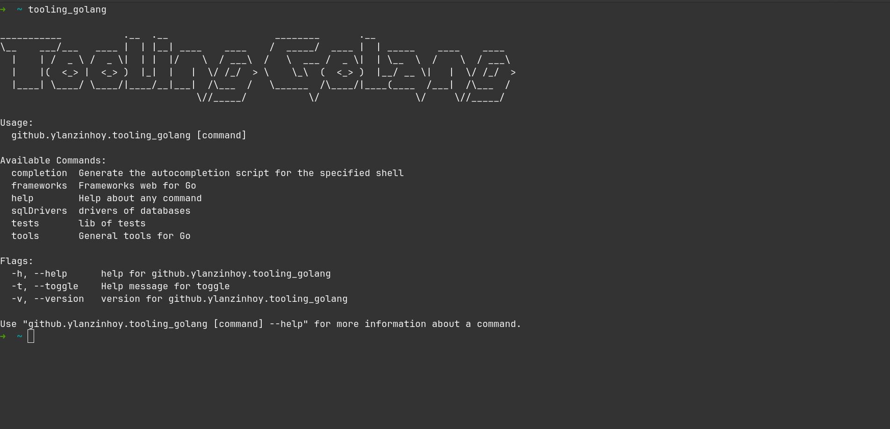

### Como instalar o tooling_golang no seu path

- depois de ter baixado aqui em `releases` a versao do tooling_golang, você vai ter o binario na sua maquina, coloque esse binario aonde você quer, abra o terminal aonde está esse binario e de um pwd. agora você copia esse path gerado e vamos colocar tanto no zsh e no bash, o caminho é o mesmo.

```
// vamos abrir o arquivo do bash ou zsh
nano ~/.bashrc
nano ~/.zhrc

// vamos colocar o path no arquivo do bash ou zsh
export Path=$Path:caminho
```

