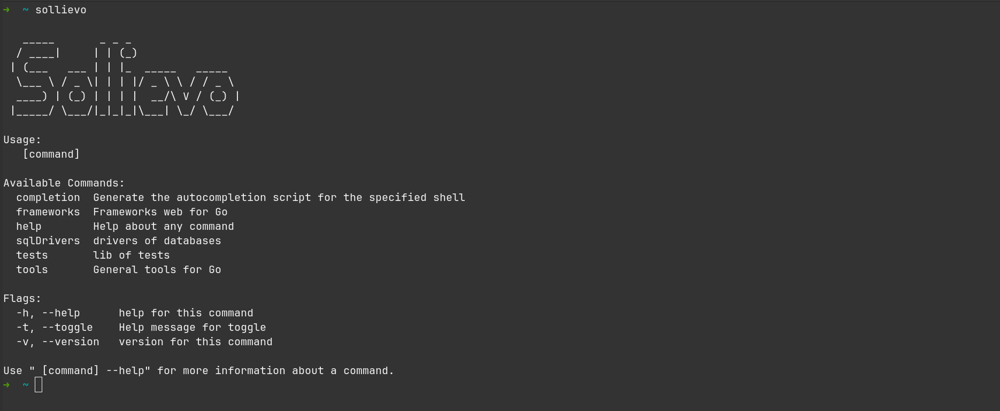

### How install Sollievo in your path?

- after having downloaded the version of Sollievo here in `releases`, you will have the binary on your machine, put this binary where you want, open the terminal where this binary is and a pwd. Now you copy this generated path and we will put it in both zsh and bash, the path is the same.

### Linux & Max
```
// lets get open your bashrc or zshrc
nano ~/.bashrc or nano ~/.zshrc

// lets put on the path in the bashrc or zshrc file
export Path=$Path:path

// run sollievo in your terminal
```
